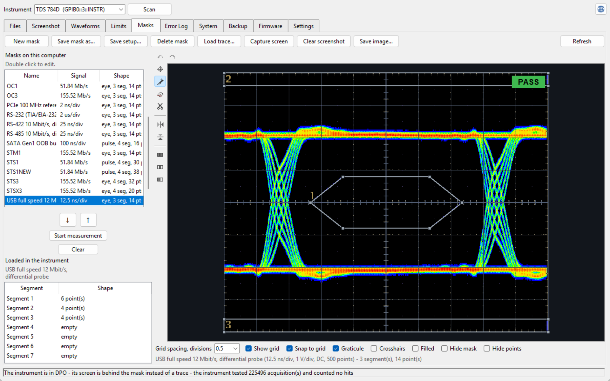

# TDS Toolkit

<p align="center">
  
</p>

An application for using Tektronix TDS500, TDS600 and TDS700 series digitizing
oscilloscopes over GPIB. It browses and transfers the instrument's files,
captures waveforms and screens, decodes captured waveforms against serial and
parallel protocols, draws and sends masks, runs limit tests, reads the service
error log, and manages the instrument's system settings.

These instruments expose a filesystem, a hardcopy port, a mask subsystem and a
limit-test subsystem over the bus, but ship with no tool to reach any of it
from a PC. This is that tool.

Full documentation is in
[TDS Toolkit User Manual (en).pdf](docs/TDS%20Toolkit%20User%20Manual%20%28en%29.pdf).

## Capabilities

| Tab | What it does |
|---|---|
| Files | Two-pane browser for the instrument's drives. Download, upload, create folders, delete, and drag files in from Explorer. |
| Screenshot | Captures the instrument's screen through its hardcopy port and saves it as PNG. Format, layout and palette are chosen in the program; the instrument's own hardcopy settings are put back afterwards. |
| Waveforms | Captures live channels and stored references, plots them together, zooms and pans, saves as ISF, CSV, WFM, PNG or SVG, and loads a file back into a reference. Decodes a captured waveform against a protocol - 26 built in, plus drop-in plugins - entirely on the PC. |
| Limits | Builds a template from the signal on screen, sends it to the instrument as a limit test, and reports the verdict. The limit envelope can be drawn or edited by hand. |
| Masks | A mask editor with a shipped library of standard telecom and serial-bus masks. Sends a mask to the instrument, sets the instrument up for an eye diagram, and counts hits against it. |
| Error Log | Reads the instrument's own service error log, saves it, and clears it. |
| Firmware | Writes a firmware image to the instrument through the ROM monitor it starts in when the NVRAM protection switch is unprotected. Backs up the existing NVRAM and firmware and verifies both before anything is erased, then reads the new image back and compares it. Images are published with the program as a single archive, read without being unpacked. |
| Backup | Captures the whole instrument to a single file - front-panel setups, the acquisition board's calibration constants, the NVRAM and the stored references - and restores any part of it, verifying as it goes. |
| System | Identity and firmware, front-panel lock, the clock, hardcopy and RS-232 ports, signal path compensation, extended diagnostics, secure erase, factory recall, the acquisition board's calibration constants, and the factory option words. |
| Settings | Plot colours and presets (including the decode-chevron colours and their fill switches), saved-picture resolution, and where the program keeps its settings and log. |

Nine language catalogues are supplied: English, Deutsch, Español, Français,
Italiano, Русский, 日本語, 简体中文 and tlhIngan Hol. The program follows the
language Windows is set to unless told otherwise, and falls back to English.
A `lang` folder beside the program overrides the bundled catalogues, so a
language can be added or corrected without rebuilding anything.

## Protocol decode

The Waveform tab decodes a **captured** waveform - a channel that was read, or a
stored reference loaded from a file - against a serial or parallel protocol, and
does it entirely on the PC. Nothing is sent to the scope: most of these
instruments cannot run a bus-decode application of their own (the on-scope
decoder needs a Java runtime the base models do not have), so the decode is done
against the samples the program already has. Pick a protocol from the list, map
a captured source to each of its wires, and press Decode; the decoded events are
drawn as chevrons on the trace and listed in a table beside the controls.

Twenty-six protocols ship:

| Family | Protocols |
|---|---|
| Async serial | RS-232 / UART, RS-422 / RS-485, MODBUS RTU, MIDI, XBee |
| Clocked | I2C, SPI, Dual SPI, I2S, I3C |
| One-wire / edge | 1-Wire, PWM |
| Automotive | CAN, LIN, FlexRay |
| Avionics (bipolar) | ARINC 429, MIL-STD-1553 |
| Audio | S/PDIF, I2S |
| Addressable LED | WS2812 / SK6812, APA102 / DotStar |
| RC links | CRSF, SBUS |
| Smart card | ISO 7816 |
| Infra-red | IrDA SIR, IR remote |

The IR-remote decoder covers thirteen consumer protocols in one: NEC, Extended
NEC, Sony SIRC, Philips RC5, RC5X, RC6, RC-MM, Samsung, LG (28-bit), JVC,
Panasonic/Kaseikyo, Denon/Sharp and Mitsubishi.

RS-232/UART is validated against a real capture corpus; the rest against
synthetic vectors. The bipolar and self-clocking ones - ARINC 429, MIL-STD-1553,
S/PDIF and FlexRay - read two thresholds or recover their own clock, and the IR
protocols are checked only against synthetic signals so far, so all of these are
worth confirming against a real capture before being trusted on live gear.

Each protocol is a small Python file in a `decoders/` folder beside the
program's settings, autopopulated the way the masks library is: drop a
`<name>.py` in and it appears in the list the next time the tab is opened, and
an update's new decoders are copied in without overwriting one you wrote. The
contract is the `Decoder` base class in `tds_decode.py`;
`decoders/_template.py`, `decoders/README.txt` and the
[decoder-writing guide](docs/TDS%20Toolkit%20-%20Writing%20a%20Protocol%20Decoder.pdf)
show how to write your own.

## What your instrument can do

Firmware decides what is possible, and the difference across the range is
large. The table below was read out of 67 firmware images.

| Generation | Browse | Download | Upload |
|---|---|---|---|
| v2.x: TDS 520, 540, 620 | no filesystem at all | no | no |
| A and B series, v3.x to v4.x | yes | yes | no |
| C and D series, v5.0e and later | yes | yes | yes |

The A and B series have no `FILESYSTEM:WRITEFILE` command, so no program can
send a file to them over GPIB. They browse and download normally.

Waveform transfer works on every instrument in the range, including the v2.x
models with no filesystem: `CURVe`, `WFMPre`, `DATa:SOURce` and
`DATa:DESTination` are present in all 35 firmware images examined.

What each known instrument can do is listed in `capabilities.json`. An
instrument that is not listed is asked directly when it connects, so it works
without anyone editing anything. A `capabilities.json` beside the program
overrides the bundled copy.

## Firmware images

The program itself bundles no firmware, but a ready-made archive of images,
`TDS-firmware-images.zip`, is attached to every [release](../../releases).
Download it and point the Firmware tab straight at the zip - it is read
without unpacking. You can equally point the tab at a folder of your own, and
it lists what is there.

Tektronix shipped one binary for a whole family, so naming an image after
one member of its family says something untrue about the other four.
`FIRMWARE-INDEX.txt` records which instruments each image is for, so the
filename does not have to, and the images in the shipped archive are named
model-free:

```
TDS_v7.4e_7e80aad5.bin     version, then the first eight digits of the
                           image's SHA-256
```

The eight digits are what make the name unique - a version alone is not,
since `v2.16e` is one image for a TDS520 and a different one for a TDS540.
A file named any other way is read for its bytes alone: the program
identifies it by its SHA-256 against the catalogue and takes its version
from the string inside the image.

The index is a plain text table, and only its `FITS` rows are read:

```
FILE                       FV        SIZE    FITS
--------------------------------------------------------------------------
TDS_v5.3e_15a07eac.bin     v5.3e     4 MB    TDS520C TDS540C TDS580C TDS754C TDS784C
TDS_v7.4e_7e80aad5.bin     v7.4e     4 MB    TDS714L TDS754D TDS784D
```

A row is the filename, the version, the size, and every model the image is
for, which must be last on the line; a column between the size and the
models is skipped, so one can be added without breaking anything. Any line
that does not fit that shape is ignored, so the rest of the file can say
whatever is useful.

The program reads the index in the folder you point at, falls back to the
copy shipped beside it, and identifies anything not listed by its SHA-256.
Adding a newly found image is a line in the index.

### Images in an archive

A folder may hold a zip of images instead of, or as well as, loose files.
The archive is read like the folder: each member is compressed on its own,
so listing costs a fraction of a second and only the image you choose to
write is decompressed. The index travels inside the archive, which is the
only one a folder holding nothing but the archive has.

Where a folder holds both, each image is listed once and the loose file is
taken - it is the image as it was dumped, where an archived one may have
had its erased tail trimmed off. Trimming loses nothing: the instrument's
flash is erased to `0xFF` before anything is written, so the bytes that
were removed are the bytes the erase puts back.

`FV` is what the instrument reports to `*IDN?` once the image is loaded,
taken from the `$VersionString: FV:v...` tag inside it. Images also carry
`FV:3.8eSparc10.atria1`, which is the machine the firmware was built on
rather than a version of anything.

The images carry no Tektronix part number - searching all 32 for one finds
nothing in that shape - so the index does not list one.

## Requirements

* A GPIB controller and its driver, for example a National Instruments
  GPIB-USB-HS, a Keysight 82357B, or an interface card.
* A VISA runtime. This is a system driver, not a Python package, and nothing
  can reach the instrument without it. Install the GPIB driver first, because
  VISA discovers the hardware through it.
  * Windows: [NI-VISA](https://www.ni.com/en/support/downloads/drivers/download.ni-visa.html)
    or the [Keysight IO Libraries Suite](https://www.keysight.com/find/iosuite).
    One, not both.
  * macOS: NI-VISA for macOS.
  * Linux: `linux-gpib`, built for your kernel. The Linux binary carries
    pyvisa-py, so it will say so if linux-gpib is missing.
* Windows, Linux or macOS. Binaries are built for all three. Only the Windows
  one is tested against real instruments; the others are the same program and
  pass the same checks against a simulator, but nobody has yet driven a scope
  from them.

Running from source additionally needs Python 3.8 or newer with Tkinter, which
the Windows installer includes.

## Install

### The executable

Download the one for your machine from [Releases](../../releases) and run it.
Each is self-contained: no Python, nothing written to the registry, and no
installer. Put it wherever suits you.

| File | For | Tested against an instrument |
|---|---|---|
| `TDS-Toolkit-windows-x86_64.exe` | Windows | Yes, a TDS 784D |
| `tds-toolkit-linux-x86_64` | Linux, glibc 2.35 or newer | **No** |
| `tds-toolkit-macos-arm64` | Apple silicon | **No** |
| `tds-toolkit-macos-x86_64` | Intel Macs | **No** |

On Linux and macOS, `chmod +x` it first.

The Linux and macOS builds are the same program from the same commit and
pass the same automated checks against a simulator, but **nobody has yet
pointed one at real hardware**. If you do, please open an issue whether it
worked or not - the VISA layer and GPIB timing are exactly what a simulator
cannot stand in for, so a report either way is worth having.

None of them is code signed. Windows brings up SmartScreen on the first run -
**More info**, then **Run anyway**. macOS brings up Gatekeeper - open it once
from the right-click menu, or clear it with
`xattr -d com.apple.quarantine <file>`.

The program keeps `tdstoolkit.json` and `tdstoolkit.log` beside the
executable, and copies its mask library into a `masks` folder there the first
time it runs. Choose a folder you can write to.

### From source

Clone this repository, then:

```
pip install -r requirements.txt
python "TDS Toolkit.pyw"
```

`requirements.txt` installs `pyvisa`, the Python binding for the VISA runtime,
and `tkinterdnd2`, which is optional and adds dragging files in from Explorer.
Without `tkinterdnd2` everything else works and the title bar says so.

To check that VISA can see the instrument before starting:

```
python -c "import pyvisa; rm = pyvisa.ResourceManager(); print(rm.list_resources())"
```

## First run

Nothing needs configuring. The program tries `GPIB0::3::INSTR`, and if nothing
answers it scans the bus and opens the instrument picker. Every address is
asked to identify itself with `*IDN?`, which changes nothing on any of them.
Pick the instrument, tick **Remember this address**, and the next run connects
straight to it.

The address can also be given on the command line, which overrides the
remembered one for that run only:

```
"TDS Toolkit.exe" --address=GPIB0::1::INSTR
```

Other switches:

| Switch | Effect |
|---|---|
| `--version` | Print the version and exit. |
| `--check-translations` | Audit `lang/*.json` and exit non-zero if anything is wrong. |

## Building the executable

```
pip install pyinstaller
pyinstaller --noconfirm --clean "TDS Toolkit.spec"
```

The spec file is the build recipe and is edited by hand. It bundles the icon,
the language catalogues, `capabilities.json` and the mask library, and stamps
the version resource from `version_info.txt`.

The released binaries are not built by hand. Tagging a commit `v*` runs
[`.github/workflows/release.yml`](.github/workflows/release.yml), which builds
each one on the system it is for - PyInstaller cannot cross-compile - and
attaches all four, plus the `TDS-firmware-images.zip` archive, to the release.
The Linux build runs on Ubuntu 22.04 rather
than the newest runner, because a binary built against an older glibc runs on
newer distributions and the reverse is not true.

## Changelog

New in **1.2.0**:

- **Protocol decode** on the Waveform tab - twenty-six decoders (RS-232/UART, I2C, SPI, CAN, IR remote and more) plus drop-in plugins, run entirely on the PC against a captured waveform. See [Protocol decode](#protocol-decode) above.
- **TDS694C support** - firmware image, capabilities and a validated NVRAM checksum table.
- **Firmware images ship with every release** as `TDS-firmware-images.zip`, read by the Firmware tab without unpacking.

New in **1.1.0**:

- **Backup tab** - back up and restore the whole instrument in one file: setups, calibration constants, NVRAM and references.
- **Firmware tab** - catalogue, identify and load firmware images, with a `FIRMWARE-INDEX.txt` recording which instruments each image is for.
- **SVG waveform export**, and saving a waveform as `.wfm` as well as `.tdw`.
- **Captures shown at the instrument's own timebase**, and a fix for the record strip in exported PNGs.
- **Limits template library**, formatting a volume, deleting the instrument's own files, and a large number of calibration, NVRAM and file-transfer fixes.

The full history is in [CHANGELOG.md](CHANGELOG.md).

## Licence

MIT. See [LICENSE](LICENSE).

Tektronix, TDS and TEK are trademarks of Tektronix, Inc. This program is not a
Tektronix product and is not endorsed by Tektronix.
